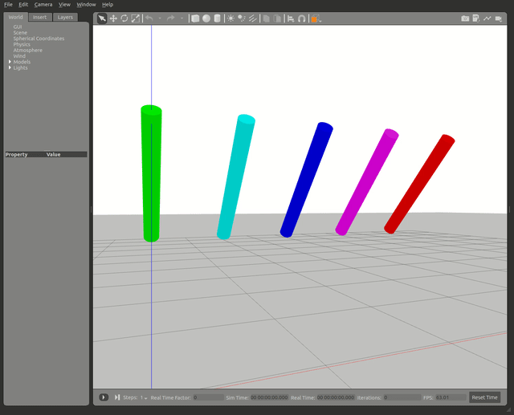

# Joint Friction

Joint friction reduces a force based on how heavy an object is.

The force balance equation:

$$
F=m\ddot{x}+b\dot{x}+kx
$$

where $F$ is an applied force, x is position, $\dot{x}$ is velocity, and $\ddot{x}$ is acceleration. $m$ is mass, $k$ is a spring constant, and $b$ is a viscous damping term.

When you plot applied torque versus speed for the unloaded system, the friction losses will be the y-intercept.

