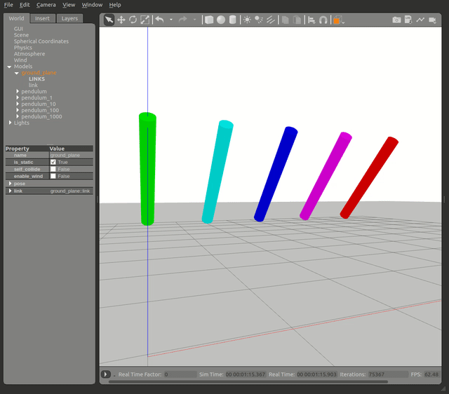
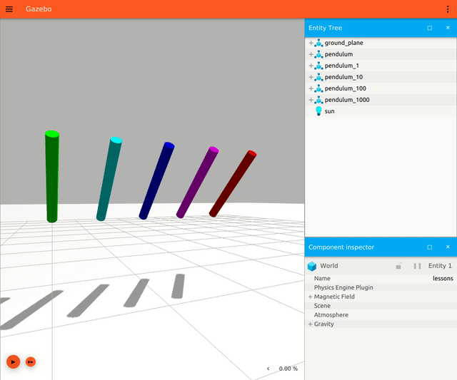

# Joint Spring Constant

The joint spring constant defines how much force the spring exerts per unit of distance from the spring's equilibrium state (the state where it is neither compressed nor stretched).

The force balance equation:

$$
F=m\ddot{x}+b\dot{x}+kx
$$

where $F$ is an applied force, x is position, $\dot{x}$ is velocity, and $\ddot{x}$ is acceleration. $m$ is mass, $k$ is a spring constant, and $b$ is a viscous damping term.

## Example code snippet

I've set the damping to 10 so that the effect of spring force restitution is more readily apparent.

```xml
      <joint name="joint" type="revolute">
        <parent>world</parent>
        <child>rod</child>
        <pose relative_to="base_link">0 0 0 0 0 0</pose>
        <axis>
          <xyz>1 0 0</xyz>
          <dynamics>
            <damping>10</damping>
            <spring_reference>-0.785398163397</spring_reference>
            <spring_stiffness>10.0</spring_stiffness>
          </dynamics>
          <limit>
            <lower>-1e+16</lower>
            <upper>1e+16</upper>
          </limit>
        </axis>
      </joint>
```

## Comparison





| color | spring constant |
| ----- | --------------- |
| green | 0               |
| teal  | 1               |
| blue  | 10              |
| pink  | 100             |
| red   | 1000            |
